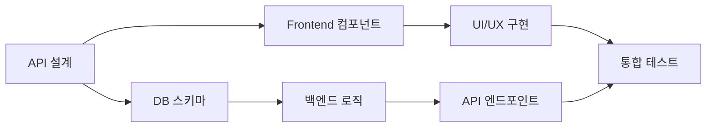

# 🔄 통합 개발 계획서 - 프론트엔드/백엔드 동시 진행

## 📋 문서 정보
**작성일**: 2025년 8월 2일  
**목적**: 프론트엔드와 백엔드를 동시에 진행하는 통합 개발 계획  
**기반**: React Native + Supabase + Vercel 아키텍처  
**개발 방식**: Fullstack 병렬 개발

## 🎯 **1차 배포 핵심 요구사항**

### **비즈니스 모델**
- ❌ **실제 상담연결 없음** (AI 기반 리딩만)
- ❌ **광고 없음** (깔끔한 사용자 경험)
- 💎 **보석(토큰) 기반 인앱구매** 시스템
- 🔒 **안정성, 보안성, 사용자 친화적 UI/UX** 최우선

### **카드덱 시스템**
```typescript
interface CardDeckTier {
  basic: {
    count: 1,
    price: 'free',
    name: '기본 타로덱'
  },
  custom: {
    count: 3,
    price: 'free',
    unlock: ['방문횟수', 'SNS홍보', '친구초대'],
    names: ['미스틱덱', '엔젤덱', '드래곤덱']
  },
  premium: {
    regular: { price: '💎50', name: '클래식 타로' },
    advanced: { price: '💎100', name: '골든 타로' },
    exclusive: { price: '💎200', name: '크리스탈 타로' },
    animated: { price: '💎300', name: '애니메이션 타로' }
  }
}
```

### **리딩 서비스**
- 📖 **TTS 리딩**: 음성으로 결과 읽어주기
- 🤖 **AI 리딩**: 구매형 고급 해석 서비스
- 🔮 **향후 확장**: 다양한 리딩 방법 추가 예정

---

## 🎯 **핵심 개발 원칙**

### **동시 개발 접근법**


### **개발 단위 (Sprint)**
- **기간**: 1주 단위 스프린트
- **범위**: 하나의 완성된 기능 (프론트+백엔드)
- **결과물**: 실제 동작하는 기능

---

## 🗓️ **주차별 통합 개발 계획**

### **Week 1: 기본 인증 및 보석(토큰) 시스템**

#### **동시 진행 작업**
```typescript
// 📱 Frontend (React Native)
/components/auth/
├── LoginScreen.tsx          // 로그인 화면
├── SignupScreen.tsx         // 회원가입 화면
├── ProfileScreen.tsx        // 프로필 관리
├── GemWallet.tsx           // 💎 보석 지갑
└── AuthContext.tsx          // 인증 상태 관리

// 🔧 Backend (Supabase)
/database/auth/
├── users-table.sql          // 사용자 테이블
├── profiles-table.sql       // 프로필 테이블
├── gems-wallet-table.sql    // 💎 보석 지갑 테이블
├── gem-transactions-table.sql // 💎 거래 내역
├── rls-policies.sql         // 보안 정책
└── auth-triggers.sql        // 자동 트리거

// 🌐 API (Vercel Edge Functions)
/api/auth/
├── register.ts              // 회원가입 API
├── login.ts                 // 로그인 API
├── profile.ts               // 프로필 API
├── gem-wallet.ts            // 💎 보석 지갑 API
└── session.ts               // 세션 관리
```

#### **1일차: API 설계 & DB 스키마**
```sql
-- 동시 작업: DB 테이블 + API 인터페이스
CREATE TABLE users (
  id UUID PRIMARY KEY DEFAULT uuid_generate_v4(),
  email TEXT UNIQUE NOT NULL,
  created_at TIMESTAMP DEFAULT NOW(),
  visit_count INTEGER DEFAULT 0,
  last_visit DATE
);

CREATE TABLE user_profiles (
  user_id UUID REFERENCES users(id),
  display_name TEXT,
  birth_date DATE,
  preferences JSONB
);

-- 💎 보석(토큰) 시스템
CREATE TABLE gem_wallets (
  user_id UUID REFERENCES users(id) PRIMARY KEY,
  gems_balance INTEGER DEFAULT 100, -- 신규 가입 보너스
  total_earned INTEGER DEFAULT 100,
  total_spent INTEGER DEFAULT 0,
  updated_at TIMESTAMP DEFAULT NOW()
);

CREATE TABLE gem_transactions (
  id UUID PRIMARY KEY DEFAULT uuid_generate_v4(),
  user_id UUID REFERENCES users(id),
  transaction_type TEXT CHECK (transaction_type IN ('earn', 'spend', 'purchase')),
  amount INTEGER NOT NULL,
  reason TEXT, -- '회원가입 보너스', 'SNS 홍보', '카드덱 구매' 등
  created_at TIMESTAMP DEFAULT NOW()
);
```

```typescript
// API 타입 정의 (프론트엔드와 공유)
interface AuthAPI {
  register(email: string, password: string): Promise<User>;
  login(email: string, password: string): Promise<Session>;
  getProfile(userId: string): Promise<UserProfile>;
}

interface GemAPI {
  getWallet(userId: string): Promise<GemWallet>;
  addGems(userId: string, amount: number, reason: string): Promise<void>;
  spendGems(userId: string, amount: number, reason: string): Promise<boolean>;
  getTransactionHistory(userId: string): Promise<GemTransaction[]>;
}

interface GemWallet {
  gems_balance: number;
  total_earned: number;
  total_spent: number;
}
```

#### **2-3일차: 프론트엔드 + 백엔드 구현**
```typescript
// 프론트엔드 (React Native)
const LoginScreen = () => {
  const [email, setEmail] = useState('');
  const [password, setPassword] = useState('');
  
  const handleLogin = async () => {
    const { data } = await supabase.auth.signInWithPassword({
      email, password
    });
    // 로그인 후 처리
  };
  
  return <LoginForm onSubmit={handleLogin} />;
};
```

```typescript
// 백엔드 (Supabase Edge Function)
export default async function handler(req: Request) {
  const { email, password } = await req.json();
  
  const { data, error } = await supabase.auth.admin
    .createUser({ email, password });
    
  return new Response(JSON.stringify({ data, error }));
}
```

#### **4-5일차: 통합 테스트 & 디버깅**

---

### **Week 2: 카드덱 시스템 & AI 타로 리딩**

#### **동시 진행 작업**
```typescript
// 📱 Frontend
/components/cards/
├── DeckLibrary.tsx          // 카드덱 라이브러리
├── DeckUnlock.tsx           // 덱 해금 시스템
├── CardSelection.tsx        // 카드 선택
├── ReadingDisplay.tsx       // 결과 표시
├── TTSPlayer.tsx            // 📖 TTS 리딩
└── PremiumReading.tsx       // 🤖 구매형 AI 리딩

// 🔧 Backend
/database/cards/
├── card-decks-table.sql     // 카드덱 테이블
├── user-decks-table.sql     // 사용자 보유 덱
├── cards-table.sql          // 개별 카드 정보
├── consultations-table.sql  // 상담 세션
├── readings-table.sql       // 리딩 결과
└── unlock-progress-table.sql // 덱 해금 진도

// 🌐 API
/api/cards/
├── get-decks.ts             // 덱 목록 조회
├── unlock-deck.ts           // 덱 해금 처리
├── purchase-deck.ts         // 💎 덱 구매
├── generate-reading.ts      // AI 해석 생성
├── text-to-speech.ts        // TTS 생성
└── premium-reading.ts       // 프리미엄 리딩
```

#### **상세 구현 스케줄**
**1일차**: 카드덱 데이터베이스 + 기본/커스텀/프리미엄 덱 설정
**2일차**: 덱 해금 시스템 (방문횟수, SNS홍보, 친구초대)
**3일차**: 💎 보석 기반 덱 구매 시스템
**4일차**: AI 리딩 생성 + TTS 음성 변환
**5일차**: 프리미엄 리딩 서비스 + UI 완성

#### **카드덱 데이터 구조**
```sql
-- 카드덱 정보
CREATE TABLE card_decks (
  id UUID PRIMARY KEY DEFAULT uuid_generate_v4(),
  name TEXT NOT NULL,
  tier TEXT CHECK (tier IN ('basic', 'custom', 'premium')) NOT NULL,
  price_gems INTEGER DEFAULT 0,
  unlock_method TEXT, -- 'default', 'visit_count', 'sns_share', 'friend_invite', 'purchase'
  unlock_requirement INTEGER, -- 방문 횟수 또는 필요 보석 수
  artwork_style TEXT, -- 'classic', 'mystic', 'angel', 'dragon', 'golden', 'crystal', 'animated'
  description TEXT,
  is_animated BOOLEAN DEFAULT FALSE,
  created_at TIMESTAMP DEFAULT NOW()
);

-- 사용자 보유 덱
CREATE TABLE user_decks (
  user_id UUID REFERENCES users(id),
  deck_id UUID REFERENCES card_decks(id),
  unlocked_at TIMESTAMP DEFAULT NOW(),
  PRIMARY KEY (user_id, deck_id)
);

-- 덱 해금 진도
CREATE TABLE unlock_progress (
  user_id UUID REFERENCES users(id),
  unlock_type TEXT, -- 'visit_count', 'sns_share', 'friend_invite'
  current_progress INTEGER DEFAULT 0,
  target_progress INTEGER,
  completed BOOLEAN DEFAULT FALSE,
  PRIMARY KEY (user_id, unlock_type)
);
```

---

### **Week 3: 인앱구매 & 보안 시스템**

#### **동시 진행 작업**
```typescript
// 📱 Frontend (인앱구매 UI)
/components/purchase/
├── GemStore.tsx             // 💎 보석 상점
├── InAppPurchase.tsx        // 인앱구매 처리
├── PurchaseHistory.tsx      // 구매 내역
├── SecuritySettings.tsx     // 보안 설정
└── PaymentMethods.tsx       // 결제 수단 관리

// 🔧 Backend (보안 & 결제)
/security/
├── payment-validation.sql   // 결제 검증
├── fraud-detection.ts       // 부정 거래 탐지
├── encryption-utils.ts      // 암호화 유틸
├── audit-logs-table.sql     // 감사 로그
└── rate-limiting.ts         // API 제한

// 🌐 API (결제 & 보안)
/api/purchase/
├── gem-packages.ts          // 보석 패키지 조회
├── process-purchase.ts      // 구매 처리
├── verify-receipt.ts        // 영수증 검증
├── refund-request.ts        // 환불 요청
└── security-audit.ts        // 보안 감사
```

---

### **Week 4: UI/UX 완성 & 성능 최적화**

#### **동시 진행 작업**
```typescript
// 📱 Frontend (UI/UX 완성)
/components/ui/
├── AnimatedCards.tsx        // 애니메이션 카드
├── LoadingStates.tsx        // 로딩 상태
├── UserFriendlyErrors.tsx   // 사용자 친화적 오류
├── AccessibilityFeatures.tsx // 접근성 기능
└── PerformanceOptimizer.tsx // 성능 최적화

// 🔧 Backend (성능 & 안정성)
/optimization/
├── caching-strategy.ts      // 캐싱 전략
├── database-indexing.sql    // DB 인덱싱
├── api-rate-limiting.ts     // API 제한
├── error-monitoring.ts      // 오류 모니터링
└── performance-metrics.ts   // 성능 지표

// 🌐 API (최적화 & 모니터링)
/api/system/
├── health-check.ts          // 시스템 상태 확인
├── performance-analytics.ts // 성능 분석
├── error-reporting.ts       // 오류 보고
└── user-analytics.ts        // 사용자 분석 (개인정보 제외)
```

#### **성능 & 보안 최적화**
```typescript
// 핵심 최적화 요소
const optimizationTargets = {
  loading: {
    cardImages: "Progressive loading + WebP format",
    ttsAudio: "Streaming audio delivery",
    aiReading: "Response caching + parallel processing"
  },
  security: {
    payment: "End-to-end encryption",
    userdata: "Zero-knowledge architecture", 
    api: "JWT + Rate limiting + CORS"
  },
  userExperience: {
    offline: "Essential features work offline",
    accessibility: "Screen reader + Voice navigation",
    performance: "< 3sec loading on 3G"
  }
}
```

---

## 🔄 **개발 워크플로우**

### **일일 개발 사이클**
```bash
# 오전 (09:00-12:00): 백엔드 먼저
1. DB 스키마 설계/수정
2. API 엔드포인트 구현
3. 비즈니스 로직 개발
4. 단위 테스트 작성

# 오후 (13:00-17:00): 프론트엔드 연동
1. API 타입 정의 업데이트
2. React Native 컴포넌트 구현
3. 상태 관리 로직 작성
4. UI/UX 구현 및 스타일링

# 저녁 (18:00-20:00): 통합 및 테스트
1. 프론트엔드-백엔드 연동 테스트
2. 버그 수정 및 성능 최적화
3. 다음날 계획 수립
4. 문서 업데이트
```

### **주간 마일스톤**
- **월요일**: 주간 목표 설정, 기술 설계
- **화-목요일**: 핵심 개발 (3일간 집중 개발)
- **금요일**: 통합 테스트, 버그 수정, 배포
- **주말**: 코드 리뷰, 문서화, 다음주 계획

---

## 🛠️ **개발 도구 및 환경**

### **코드 동기화**
```json
{
  "shared_types": "/types/api-types.ts",
  "shared_utils": "/utils/common-utils.ts",
  "env_config": {
    "development": ".env.development",
    "staging": ".env.staging", 
    "production": ".env.production"
  }
}
```

### **실시간 협업 도구**
```typescript
// 개발 환경 설정
const devConfig = {
  frontend: {
    port: 3000,
    apiUrl: "http://localhost:3001"
  },
  backend: {
    port: 3001,
    dbUrl: "postgresql://localhost:5432/tarot_dev"
  },
  hotReload: true,
  apiMocking: true
};
```

---

## 📊 **진행률 추적**

### **주간 체크리스트**
```markdown
### Week 1 Progress
- [ ] 사용자 인증 (프론트엔드 70%, 백엔드 80%)
- [ ] 프로필 관리 (프론트엔드 60%, 백엔드 90%)
- [ ] 세션 관리 (프론트엔드 50%, 백엔드 100%)

### Week 2 Progress  
- [ ] AI 상담 시작 (프론트엔드 0%, 백엔드 0%)
- [ ] 카드 선택 UI (프론트엔드 0%, 백엔드 0%)
- [ ] 결과 표시 (프론트엔드 0%, 백엔드 0%)
```

### **일일 커밋 규칙**
```bash
# 동시 개발 커밋 메시지 형식
git commit -m "feat: Add user authentication [Frontend + Backend]

- Frontend: Login/Signup screens with form validation
- Backend: User registration API with email verification  
- Database: Users table with RLS policies
- Integration: End-to-end authentication flow

Co-authored-by: Frontend-Dev <frontend@team.com>
Co-authored-by: Backend-Dev <backend@team.com>"
```

---

## 🚀 **배포 전략**

### **단계별 배포**
1. **개발 환경**: 매일 자동 배포
2. **스테이징**: 주간 마일스톤마다 배포
3. **프로덕션**: 2주마다 안정 버전 배포

### **배포 체크리스트**
```bash
# 배포 전 확인사항
- [ ] 프론트엔드 빌드 성공
- [ ] 백엔드 API 테스트 통과
- [ ] 데이터베이스 마이그레이션 완료
- [ ] 환경변수 설정 확인
- [ ] 성능 테스트 통과
- [ ] 보안 검사 완료
```

---

## 🎯 **1차 배포 성공 지표**

### **비즈니스 목표**
- **안정성**: 99.9% 업타임, 무광고 환경
- **보안성**: 결제 정보 암호화, 개인정보 보호
- **사용자 경험**: 직관적 UI, 3초 내 로딩
- **수익성**: 💎 보석 기반 건전한 수익 모델

### **기능 완성도**
- **카드덱**: 기본 1개 + 커스텀 3개 + 프리미엄 4개
- **해금 시스템**: 방문횟수, SNS홍보, 친구초대
- **AI 서비스**: 기본 리딩 + TTS + 프리미엄 리딩
- **결제**: 💎 보석 인앱구매, 영수증 검증

### **기술 품질**
- **테스트 커버리지**: 90%+ (결제 시스템 중요)
- **성능**: API 응답 < 200ms, TTS 생성 < 5초
- **보안**: End-to-end 암호화, JWT 인증
- **접근성**: 음성 지원, 다양한 디바이스 대응

---

## 📋 **1차 배포 로드맵**

### **즉시 시작 항목 (이번 주)**
1. **개발 환경 구성**: Supabase + Vercel + React Native
2. **보석 시스템 설계**: 💎 토큰 기반 인앱구매 구조
3. **카드덱 데이터 준비**: 8개 덱 (기본1+커스텀3+프리미엄4)

### **4주 완성 목표**
- **Week 1**: 인증 + 💎 보석 지갑 시스템
- **Week 2**: 카드덱 라이브러리 + AI 리딩 + TTS
- **Week 3**: 인앱구매 + 보안 강화
- **Week 4**: UI/UX 완성 + 성능 최적화

### **1차 배포 특징**
- ❌ **실제 상담 연결 없음** (AI만)
- ❌ **광고 없음** (깔끔한 환경)
- 💎 **보석 기반 수익화** (건전한 모델)
- 🔒 **보안성 최우선** (결제 정보 보호)
- 📱 **사용자 친화적** (직관적 UI/UX)

---

*문서 버전: v1.0*  
*최종 수정: 2025.08.02*  
*개발 방식: Fullstack 병렬 개발*  
*프로젝트 경로: /Volumes/PROJECT/apps/card/*