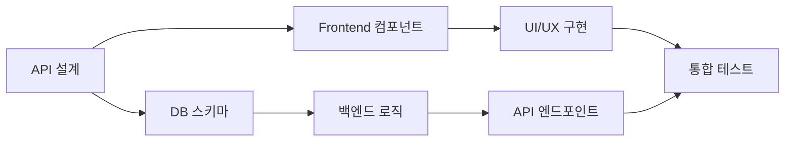

# 🔄 통합 개발 계획서 - 프론트엔드/백엔드 동시 진행

## 📋 문서 정보
**작성일**: 2025년 8월 2일  
**목적**: 프론트엔드와 백엔드를 동시에 진행하는 통합 개발 계획  
**기반**: React Native + Supabase + Vercel 아키텍처  
**개발 방식**: Fullstack 병렬 개발

## 🎯 **1차 배포 핵심 요구사항**

### **비즈니스 모델**
- ❌ **실제 상담연결 없음** (AI 기반 리딩만)
- ❌ **광고 없음** (깔끔한 사용자 경험)
- 💎 **보석(토큰) 기반 인앱구매** 시스템
- 🔒 **안정성, 보안성, 사용자 친화적 UI/UX** 최우선

### **카드덱 시스템**
```typescript
interface CardDeckTier {
  basic: {
    count: 1,
    price: 'free',
    name: '기본 타로덱'
  },
  custom: {
    count: 3,
    price: 'free',
    unlock: ['방문횟수', 'SNS홍보', '친구초대'],
    names: ['미스틱덱', '엔젤덱', '드래곤덱']
  },
  premium: {
    regular: { price: '💎50', name: '클래식 타로' },
    advanced: { price: '💎100', name: '골든 타로' },
    exclusive: { price: '💎200', name: '크리스탈 타로' },
    animated: { price: '💎300', name: '애니메이션 타로' }
  }
}
```

### **리딩 서비스**
- 📖 **TTS 리딩**: 음성으로 결과 읽어주기
- 🤖 **AI 리딩**: 구매형 고급 해석 서비스 (비동기 처리)
- 📱 **백그라운드 처리**: AI 리딩 중 앱 종료해도 완료시 푸시 알림
- 💎 **보석 보호**: 결제 후 AI 처리 실패시 자동 환불 시스템
- 🔮 **향후 확장**: 다양한 리딩 방법 추가 예정

### **다국어 지원 시스템**
```typescript
interface LanguageSupport {
  primary: 'ko',
  supported: ['en', 'ja', 'zh-CN', 'zh-TW', 'es', 'fr', 'de', 'pt', 'ru'],
  features: {
    ui: 'Full UI translation',
    cards: 'Card names and meanings',
    readings: 'AI interpretation in user language',
    tts: 'Text-to-speech in native language'
  }
}
```

### **글로벌 시장 대응**
- 🌍 **10개 언어 지원**: 한국어(기본) + 영어, 일본어, 중국어(간체/번체), 스페인어, 프랑스어, 독일어, 포르투갈어, 러시아어
- 🎯 **문화적 적응**: 지역별 타로 해석 스타일 차별화
- 💱 **현지화**: 각 국가별 통화 및 결제 시스템 지원

---

## 🎯 **핵심 개발 원칙**

### **동시 개발 접근법**


### **개발 단위 (Sprint)**
- **기간**: 1주 단위 스프린트
- **범위**: 하나의 완성된 기능 (프론트+백엔드)
- **결과물**: 실제 동작하는 기능

---

## 🗓️ **주차별 통합 개발 계획**

### **Week 1: 기본 인증 및 보석(토큰) 시스템 + 다국어 기반**

#### **동시 진행 작업**
```typescript
// 📱 Frontend (React Native)
/components/auth/
├── LoginScreen.tsx          // 로그인 화면
├── SignupScreen.tsx         // 회원가입 화면
├── ProfileScreen.tsx        // 프로필 관리
├── LanguageSelector.tsx     // 🌍 언어 선택
├── GemWallet.tsx           // 💎 보석 지갑
└── AuthContext.tsx          // 인증 상태 관리

// 🌍 Internationalization
/i18n/
├── index.ts                 // i18n 설정
├── locales/
│   ├── ko.json             // 한국어 (기본)
│   ├── en.json             // 영어
│   ├── ja.json             // 일본어
│   ├── zh-CN.json          // 중국어(간체)
│   └── [8 more languages]  // 기타 언어들
└── utils/
    ├── translator.ts        // 번역 유틸리티
    └── currency.ts          // 통화 변환

// 🔧 Backend (Supabase)
/database/auth/
├── users-table.sql          // 사용자 테이블 (언어 설정 포함)
├── profiles-table.sql       // 프로필 테이블
├── gems-wallet-table.sql    // 💎 보석 지갑 테이블
├── gem-transactions-table.sql // 💎 거래 내역
├── user-preferences-table.sql // 사용자 설정 (언어, 지역)
├── reading-history-table.sql   // 📚 리딩 히스토리 테이블
├── reading-sessions-table.sql  // 📖 리딩 세션 테이블
├── rls-policies.sql         // 보안 정책
└── auth-triggers.sql        // 자동 트리거

// 🌐 API (Vercel Edge Functions)
/api/auth/
├── register.ts              // 회원가입 API
├── login.ts                 // 로그인 API
├── profile.ts               // 프로필 API
├── gem-wallet.ts            // 💎 보석 지갑 API
├── language-settings.ts     // 언어 설정 API
├── reading-history.ts       // 📚 리딩 히스토리 API
└── session.ts               // 세션 관리
```

#### **1일차: API 설계 & DB 스키마 (다국어 지원)**
```sql
-- 동시 작업: DB 테이블 + API 인터페이스
CREATE TABLE users (
  id UUID PRIMARY KEY DEFAULT uuid_generate_v4(),
  email TEXT UNIQUE NOT NULL,
  created_at TIMESTAMP DEFAULT NOW(),
  visit_count INTEGER DEFAULT 0,
  last_visit DATE,
  preferred_language TEXT DEFAULT 'ko', -- 사용자 선호 언어
  timezone TEXT DEFAULT 'Asia/Seoul'    -- 사용자 시간대
);

CREATE TABLE user_profiles (
  user_id UUID REFERENCES users(id),
  display_name TEXT,
  birth_date DATE,
  preferences JSONB,
  country_code TEXT DEFAULT 'KR',       -- 국가 코드
  currency_code TEXT DEFAULT 'KRW'      -- 통화 코드
);

-- 🌍 다국어 설정 테이블
CREATE TABLE user_preferences (
  user_id UUID REFERENCES users(id) PRIMARY KEY,
  language TEXT DEFAULT 'ko',
  region TEXT DEFAULT 'KR',
  currency TEXT DEFAULT 'KRW',
  date_format TEXT DEFAULT 'YYYY-MM-DD',
  time_format TEXT DEFAULT '24h',
  updated_at TIMESTAMP DEFAULT NOW()
);

-- 📚 리딩 히스토리 테이블
CREATE TABLE reading_history (
  id UUID PRIMARY KEY DEFAULT uuid_generate_v4(),
  user_id UUID REFERENCES users(id),
  session_id UUID,                    -- 리딩 세션 ID
  reading_type TEXT NOT NULL,         -- 'single', 'three-card', 'relationship', 'celtic-cross'
  question TEXT NOT NULL,             -- 사용자 질문
  selected_cards JSONB NOT NULL,      -- 선택된 카드들 정보
  ai_interpretation TEXT,             -- AI 해석 결과
  reading_language TEXT DEFAULT 'ko', -- 리딩 언어
  deck_used TEXT,                     -- 사용된 카드덱
  is_premium BOOLEAN DEFAULT FALSE,   -- 프리미엄 리딩 여부
  gems_spent INTEGER DEFAULT 0,      -- 사용된 보석 수
  user_rating INTEGER,               -- 사용자 평점 (1-5)
  is_favorite BOOLEAN DEFAULT FALSE, -- 즐겨찾기 여부
  created_at TIMESTAMP DEFAULT NOW(),
  updated_at TIMESTAMP DEFAULT NOW()
);

-- 📖 리딩 세션 테이블 (실시간 진행 상태 + 비동기 처리)
CREATE TABLE reading_sessions (
  id UUID PRIMARY KEY DEFAULT uuid_generate_v4(),
  user_id UUID REFERENCES users(id),
  status TEXT DEFAULT 'started',     -- 'started', 'payment_confirmed', 'cards_selected', 'ai_processing', 'completed', 'failed', 'cancelled'
  reading_type TEXT NOT NULL,
  question TEXT,
  selected_cards JSONB,
  deck_used TEXT,
  is_premium BOOLEAN DEFAULT FALSE,
  gems_reserved INTEGER DEFAULT 0,   -- 예약된 보석 (처리 완료시 차감)
  gems_charged INTEGER DEFAULT 0,    -- 실제 차감된 보석
  ai_job_id TEXT,                    -- AI 처리 작업 ID
  ai_started_at TIMESTAMP,           -- AI 처리 시작 시간
  ai_completed_at TIMESTAMP,         -- AI 처리 완료 시간
  progress INTEGER DEFAULT 0,        -- 진행률 (0-100)
  error_message TEXT,                -- 오류 메시지
  retry_count INTEGER DEFAULT 0,     -- 재시도 횟수
  notification_sent BOOLEAN DEFAULT FALSE, -- 푸시 알림 발송 여부
  created_at TIMESTAMP DEFAULT NOW(),
  updated_at TIMESTAMP DEFAULT NOW()
);

-- 📱 푸시 알림 테이블
CREATE TABLE push_notifications (
  id UUID PRIMARY KEY DEFAULT uuid_generate_v4(),
  user_id UUID REFERENCES users(id),
  session_id UUID REFERENCES reading_sessions(id),
  notification_type TEXT NOT NULL,   -- 'reading_completed', 'reading_failed', 'refund_processed'
  title TEXT NOT NULL,
  message TEXT NOT NULL,
  data JSONB,                        -- 추가 데이터 (deep link 등)
  device_tokens TEXT[],              -- 사용자의 디바이스 토큰들
  sent_at TIMESTAMP,                 -- 발송 시간
  delivery_status TEXT DEFAULT 'pending', -- 'pending', 'sent', 'delivered', 'failed'
  created_at TIMESTAMP DEFAULT NOW()
);

-- 💎 보석 예약/환불 테이블
CREATE TABLE gem_reservations (
  id UUID PRIMARY KEY DEFAULT uuid_generate_v4(),
  user_id UUID REFERENCES users(id),
  session_id UUID REFERENCES reading_sessions(id),
  amount INTEGER NOT NULL,           -- 예약/환불 보석 수
  type TEXT NOT NULL,               -- 'reserve', 'charge', 'refund'
  status TEXT DEFAULT 'pending',    -- 'pending', 'completed', 'failed'
  reason TEXT,                      -- 예약/환불 사유
  processed_at TIMESTAMP,
  created_at TIMESTAMP DEFAULT NOW()
);

-- 💎 보석(토큰) 시스템
CREATE TABLE gem_wallets (
  user_id UUID REFERENCES users(id) PRIMARY KEY,
  gems_balance INTEGER DEFAULT 100, -- 신규 가입 보너스
  total_earned INTEGER DEFAULT 100,
  total_spent INTEGER DEFAULT 0,
  updated_at TIMESTAMP DEFAULT NOW()
);

CREATE TABLE gem_transactions (
  id UUID PRIMARY KEY DEFAULT uuid_generate_v4(),
  user_id UUID REFERENCES users(id),
  transaction_type TEXT CHECK (transaction_type IN ('earn', 'spend', 'purchase')),
  amount INTEGER NOT NULL,
  reason TEXT, -- '회원가입 보너스', 'SNS 홍보', '카드덱 구매' 등
  created_at TIMESTAMP DEFAULT NOW()
);
```

```typescript
// API 타입 정의 (프론트엔드와 공유)
interface AuthAPI {
  register(email: string, password: string, language?: string): Promise<User>;
  login(email: string, password: string): Promise<Session>;
  getProfile(userId: string): Promise<UserProfile>;
}

interface GemAPI {
  getWallet(userId: string): Promise<GemWallet>;
  addGems(userId: string, amount: number, reason: string): Promise<void>;
  spendGems(userId: string, amount: number, reason: string): Promise<boolean>;
  getTransactionHistory(userId: string): Promise<GemTransaction[]>;
}

// 🌍 다국어 API
interface LanguageAPI {
  getUserLanguage(userId: string): Promise<UserPreferences>;
  setUserLanguage(userId: string, preferences: UserPreferences): Promise<void>;
  getAvailableLanguages(): Promise<LanguageOption[]>;
  translateText(text: string, fromLang: string, toLang: string): Promise<string>;
}

// 📚 리딩 히스토리 API
interface ReadingHistoryAPI {
  saveReading(reading: ReadingRecord): Promise<ReadingRecord>;
  getUserHistory(userId: string, page?: number, limit?: number): Promise<ReadingHistory>;
  getReadingById(readingId: string): Promise<ReadingRecord>;
  updateReading(readingId: string, updates: Partial<ReadingRecord>): Promise<void>;
  deleteReading(readingId: string): Promise<void>;
  getFavoriteReadings(userId: string): Promise<ReadingRecord[]>;
  rateReading(readingId: string, rating: number): Promise<void>;
  shareReading(readingId: string): Promise<string>; // 공유 URL 반환
}

// 🔄 비동기 AI 리딩 API
interface AsyncReadingAPI {
  startReading(sessionData: ReadingSessionData): Promise<ReadingSession>;
  checkReadingStatus(sessionId: string): Promise<ReadingSession>;
  reserveGems(userId: string, amount: number, sessionId: string): Promise<GemReservation>;
  processGemPayment(reservationId: string): Promise<void>;
  refundGems(reservationId: string, reason: string): Promise<void>;
  cancelReading(sessionId: string): Promise<void>;
  retryFailedReading(sessionId: string): Promise<void>;
}

// 📱 푸시 알림 API
interface PushNotificationAPI {
  registerDevice(userId: string, deviceToken: string, platform: 'ios' | 'android'): Promise<void>;
  sendReadingCompletedNotification(sessionId: string): Promise<void>;
  sendReadingFailedNotification(sessionId: string, reason: string): Promise<void>;
  sendRefundNotification(userId: string, amount: number): Promise<void>;
  getUserNotificationHistory(userId: string): Promise<PushNotification[]>;
}

interface ReadingSession {
  id: string;
  user_id: string;
  status: 'started' | 'payment_confirmed' | 'cards_selected' | 'ai_processing' | 'completed' | 'failed' | 'cancelled';
  reading_type: string;
  question: string;
  selected_cards?: any[];
  gems_reserved: number;
  gems_charged: number;
  ai_job_id?: string;
  progress: number;
  error_message?: string;
  retry_count: number;
  estimated_completion: string; // 예상 완료 시간
  created_at: string;
  updated_at: string;
}

interface ReadingRecord {
  id: string;
  user_id: string;
  session_id?: string;
  reading_type: 'single' | 'three-card' | 'relationship' | 'celtic-cross';
  question: string;
  selected_cards: Card[];
  ai_interpretation: string;
  reading_language: string;
  deck_used: string;
  is_premium: boolean;
  gems_spent: number;
  user_rating?: number;
  is_favorite: boolean;
  created_at: string;
  updated_at: string;
}

interface ReadingHistory {
  readings: ReadingRecord[];
  total_count: number;
  page: number;
  has_next: boolean;
}

interface UserPreferences {
  language: string;
  region: string;
  currency: string;
  timezone: string;
  date_format: string;
  time_format: string;
}

interface LanguageOption {
  code: string;      // 'ko', 'en', 'ja' 등
  name: string;      // '한국어', 'English', '日本語'
  nativeName: string; // 현지어로 된 언어명
  flag: string;      // 국기 이모지
  supported: boolean; // 지원 여부
}
```

#### **2-3일차: 프론트엔드 + 백엔드 구현 (비동기 AI 리딩 시스템)**
```typescript
// 프론트엔드 (React Native) - 비동기 AI 리딩 처리
const AsyncReadingService = () => {
  const startAsyncReading = async (readingData: ReadingSessionData) => {
    try {
      // 1. 보석 사전 예약 (실제 차감 X)
      const reservation = await asyncReadingAPI.reserveGems(
        currentUser.id, 
        readingData.gemCost, 
        readingData.sessionId
      );
      
      // 2. AI 리딩 비동기 시작
      const session = await asyncReadingAPI.startReading({
        ...readingData,
        reservationId: reservation.id
      });
      
      // 3. 사용자에게 즉시 피드백
      showToast({
        title: '🔮 AI 리딩 시작됨',
        message: `약 ${session.estimated_completion}분 후 완료 예정\n앱을 종료해도 푸시 알림으로 알려드려요!`,
        type: 'info',
        duration: 5000
      });
      
      // 4. 진행 상태 주기적 체크 (앱이 열려있을 때만)
      const statusChecker = setInterval(async () => {
        const updatedSession = await asyncReadingAPI.checkReadingStatus(session.id);
        
        if (updatedSession.status === 'completed') {
          clearInterval(statusChecker);
          handleReadingCompleted(updatedSession);
        } else if (updatedSession.status === 'failed') {
          clearInterval(statusChecker);
          handleReadingFailed(updatedSession);
        } else {
          updateProgress(updatedSession.progress);
        }
      }, 10000); // 10초마다 체크
      
      return session;
    } catch (error) {
      console.error('리딩 시작 실패:', error);
      showErrorAlert('리딩 시작에 실패했습니다. 다시 시도해주세요.');
    }
  };
  
  const handleReadingCompleted = async (session: ReadingSession) => {
    // 완료된 리딩 데이터 가져오기
    const completedReading = await readingAPI.getReadingById(session.id);
    
    // 히스토리에 자동 저장
    await autoSaveReading(completedReading);
    
    // 사용자에게 완료 알림
    showSuccessAlert({
      title: '🎉 리딩 완료!',
      message: '타로 해석이 완성되었습니다.',
      buttonText: '결과 보기',
      onPress: () => navigateToReadingResult(completedReading.id)
    });
  };
  
  const handleReadingFailed = async (session: ReadingSession) => {
    // 자동 환불 처리
    if (session.gems_reserved > 0) {
      await asyncReadingAPI.refundGems(session.reservationId, 'ai_processing_failed');
    }
    
    showErrorAlert({
      title: '😔 리딩 처리 실패',
      message: '기술적 문제로 리딩이 실패했습니다.\n보석이 자동으로 환불되었습니다.',
      buttonText: '다시 시도',
      onPress: () => asyncReadingAPI.retryFailedReading(session.id)
    });
  };
};

// 로그인 화면
const LoginScreen = () => {
  const [email, setEmail] = useState('');
  const [password, setPassword] = useState('');
  
  const handleLogin = async () => {
    const { data } = await supabase.auth.signInWithPassword({
      email, password
    });
    // 로그인 후 처리
  };
  
  return <LoginForm onSubmit={handleLogin} />;
};
```

```typescript
// 백엔드 (Supabase Edge Function) - 비동기 AI 리딩 처리
export default async function asyncReadingHandler(req: Request) {
  const { action, sessionData } = await req.json();
  
  try {
    switch (action) {
      case 'start_reading':
        return await startAsyncReading(sessionData);
      case 'check_status':
        return await checkReadingStatus(sessionData.sessionId);
      case 'process_ai_job':
        return await processAIJob(sessionData);
      default:
        throw new Error('Invalid action');
    }
  } catch (error) {
    console.error('Async reading error:', error);
    return new Response(JSON.stringify({ 
      success: false, 
      error: error.message 
    }), { status: 500 });
  }
}

async function startAsyncReading(sessionData: any) {
  // 1. 보석 예약 (실제 차감하지 않음)
  const reservation = await reserveGems(
    sessionData.user_id, 
    sessionData.gem_cost,
    sessionData.session_id
  );
  
  // 2. 세션 상태를 'ai_processing'으로 업데이트
  const { data: session } = await supabase
    .from('reading_sessions')
    .update({
      status: 'ai_processing',
      gems_reserved: sessionData.gem_cost,
      ai_started_at: new Date().toISOString(),
      progress: 10
    })
    .eq('id', sessionData.session_id)
    .select()
    .single();
  
  // 3. AI 작업을 백그라운드 큐에 추가
  const aiJobId = await addToAIQueue({
    sessionId: sessionData.session_id,
    userId: sessionData.user_id,
    question: sessionData.question,
    selectedCards: sessionData.selected_cards,
    readingType: sessionData.reading_type,
    language: sessionData.language
  });
  
  // 4. AI 작업 ID 저장
  await supabase
    .from('reading_sessions')
    .update({ ai_job_id: aiJobId })
    .eq('id', sessionData.session_id);
  
  return new Response(JSON.stringify({ 
    success: true, 
    session,
    estimated_completion: '2-3' // 2-3분 예상
  }));
}

async function processAIJob(jobData: any) {
  const { sessionId, userId, question, selectedCards, readingType, language } = jobData;
  
  try {
    // 진행률 업데이트 (30%)
    await updateProgress(sessionId, 30);
    
    // AI 해석 생성 (xAI API 호출)
    const aiInterpretation = await generateAIReading({
      question,
      selectedCards,
      readingType,
      language
    });
    
    // 진행률 업데이트 (70%)
    await updateProgress(sessionId, 70);
    
    // TTS 생성 (선택적)
    const ttsUrl = await generateTTS(aiInterpretation, language);
    
    // 진행률 업데이트 (90%)
    await updateProgress(sessionId, 90);
    
    // 히스토리에 저장
    const savedReading = await saveToHistory({
      sessionId,
      userId,
      question,
      selectedCards,
      aiInterpretation,
      ttsUrl,
      language
    });
    
    // 보석 실제 차감
    await processGemPayment(sessionId);
    
    // 세션 완료 처리
    await supabase
      .from('reading_sessions')
      .update({
        status: 'completed',
        progress: 100,
        ai_completed_at: new Date().toISOString()
      })
      .eq('id', sessionId);
    
    // 푸시 알림 발송
    await sendPushNotification(userId, {
      type: 'reading_completed',
      title: '🎉 타로 리딩 완료!',
      message: '당신의 타로 해석이 준비되었습니다.',
      data: { readingId: savedReading.id, sessionId }
    });
    
    return { success: true, readingId: savedReading.id };
    
  } catch (error) {
    // 실패 처리
    await handleAIJobFailure(sessionId, error.message);
    throw error;
  }
}

async function handleAIJobFailure(sessionId: string, errorMessage: string) {
  // 세션을 실패 상태로 업데이트
  await supabase
    .from('reading_sessions')
    .update({
      status: 'failed',
      error_message: errorMessage,
      retry_count: supabase.raw('retry_count + 1')
    })
    .eq('id', sessionId);
  
  // 보석 자동 환불
  await processRefund(sessionId, 'ai_processing_failed');
  
  // 실패 알림 발송
  const session = await getSession(sessionId);
  await sendPushNotification(session.user_id, {
    type: 'reading_failed',
    title: '😔 리딩 처리 실패',
    message: '기술적 문제로 리딩이 실패했습니다. 보석이 환불되었습니다.',
    data: { sessionId, canRetry: session.retry_count < 3 }
  });
}
```

#### **4-5일차: 통합 테스트 & 디버깅**

---

### **Week 2: 카드덱 시스템 & AI 타로 리딩 (다국어 AI)**

#### **동시 진행 작업**
```typescript
// 📱 Frontend
/components/cards/
├── DeckLibrary.tsx          // 카드덱 라이브러리
├── DeckUnlock.tsx           // 덱 해금 시스템
├── CardSelection.tsx        // 카드 선택
├── ReadingDisplay.tsx       // 결과 표시
├── TTSPlayer.tsx            // 📖 TTS 리딩 (다국어)
├── PremiumReading.tsx       // 🤖 구매형 AI 리딩
├── LanguageSwitch.tsx       // 실시간 언어 전환
└── ReadingHistory.tsx       // 📚 리딩 히스토리

/components/history/
├── HistoryList.tsx          // 히스토리 목록
├── HistoryCard.tsx          // 개별 히스토리 카드
├── HistoryFilter.tsx        // 히스토리 필터링
├── FavoriteReadings.tsx     // 즐겨찾기 리딩
├── ShareReading.tsx         // 리딩 공유 기능
└── ReadingStats.tsx         // 리딩 통계

// 🌍 Multilingual Content
/content/
├── cards/
│   ├── names/               // 카드 이름 번역
│   │   ├── ko.json         // 한국어 카드명
│   │   ├── en.json         // 영어 카드명
│   │   └── [8 more]        // 기타 언어
│   └── meanings/            // 카드 의미 번역
│       ├── ko.json         // 한국어 의미
│       ├── en.json         // 영어 의미
│       └── [8 more]        // 기타 언어
└── spreads/
    ├── descriptions/        // 스프레드 설명
    └── instructions/        // 사용 방법

// 🔧 Backend
/database/cards/
├── card-decks-table.sql     // 카드덱 테이블
├── user-decks-table.sql     // 사용자 보유 덱
├── cards-table.sql          // 개별 카드 정보
├── card-translations-table.sql // 카드 번역 테이블
├── reading-history-table.sql   // 📚 리딩 히스토리 (Week 1에서 이동)
├── reading-sessions-table.sql  // 📖 리딩 세션
├── reading-shares-table.sql    // 📤 리딩 공유 링크
└── unlock-progress-table.sql   // 덱 해금 진도

// 🌐 API
/api/cards/
├── get-decks.ts             // 덱 목록 조회 (언어별)
├── unlock-deck.ts           // 덱 해금 처리
├── purchase-deck.ts         // 💎 덱 구매
├── generate-reading.ts      // AI 해석 생성 (다국어)
├── text-to-speech.ts        // TTS 생성 (다국어)
├── translate-reading.ts     // 리딩 결과 번역
├── premium-reading.ts       // 프리미엄 리딩
└── save-reading.ts          // 📚 리딩 자동 저장

/api/async-reading/
├── start-reading.ts         // 🔄 비동기 리딩 시작
├── check-status.ts          // 📊 리딩 진행 상태 확인
├── process-ai-job.ts        // 🤖 AI 작업 처리 (백그라운드)
├── reserve-gems.ts          // 💎 보석 사전 예약
├── process-payment.ts       // 💳 결제 처리
├── refund-gems.ts           // 💰 자동 환불
└── retry-reading.ts         // 🔄 실패한 리딩 재시도

/api/notifications/
├── register-device.ts       // 📱 디바이스 토큰 등록
├── send-push.ts             // 📤 푸시 알림 발송
├── notification-history.ts  // 📋 알림 기록 조회
└── update-preferences.ts    // ⚙️ 알림 설정 업데이트

/api/history/
├── get-history.ts           // 사용자 히스토리 조회
├── get-reading.ts           // 개별 리딩 조회
├── update-reading.ts        // 리딩 업데이트 (평점, 즐겨찾기)
├── delete-reading.ts        // 리딩 삭제
├── share-reading.ts         // 리딩 공유 링크 생성
└── reading-stats.ts         // 사용자 리딩 통계
```

#### **상세 구현 스케줄**
**1일차**: 카드덱 데이터베이스 + 다국어 카드 번역 시스템 구축
**2일차**: 덱 해금 시스템 + 언어별 UI 텍스트 적용
**3일차**: 💎 보석 예약/환불 시스템 + 📚 리딩 자동 저장 시스템
**4일차**: 🔄 비동기 AI 리딩 처리 + 📱 푸시 알림 시스템 구현
**5일차**: 리딩 공유 기능 + 즐겨찾기 + 백그라운드 작업 큐 완성

#### **카드덱 데이터 구조 (다국어 지원)**
```sql
-- 카드덱 정보
CREATE TABLE card_decks (
  id UUID PRIMARY KEY DEFAULT uuid_generate_v4(),
  name_key TEXT NOT NULL,              -- 번역 키 (예: 'deck.basic.name')
  tier TEXT CHECK (tier IN ('basic', 'custom', 'premium')) NOT NULL,
  price_gems INTEGER DEFAULT 0,
  unlock_method TEXT, -- 'default', 'visit_count', 'sns_share', 'friend_invite', 'purchase'
  unlock_requirement INTEGER, -- 방문 횟수 또는 필요 보석 수
  artwork_style TEXT, -- 'classic', 'mystic', 'angel', 'dragon', 'golden', 'crystal', 'animated'
  description_key TEXT,                -- 설명 번역 키
  is_animated BOOLEAN DEFAULT FALSE,
  created_at TIMESTAMP DEFAULT NOW()
);

-- 🌍 카드 번역 테이블
CREATE TABLE card_translations (
  id UUID PRIMARY KEY DEFAULT uuid_generate_v4(),
  card_id TEXT NOT NULL,              -- 카드 식별자 (예: 'the-fool')
  language_code TEXT NOT NULL,        -- 언어 코드 (ko, en, ja 등)
  name TEXT NOT NULL,                 -- 번역된 카드 이름
  meaning TEXT,                       -- 번역된 카드 의미
  description TEXT,                   -- 번역된 카드 설명
  keywords TEXT[],                    -- 번역된 키워드들
  created_at TIMESTAMP DEFAULT NOW(),
  UNIQUE(card_id, language_code)
);

-- 💰 통화별 가격 테이블
CREATE TABLE deck_pricing (
  deck_id UUID REFERENCES card_decks(id),
  currency_code TEXT NOT NULL,        -- KRW, USD, JPY, EUR 등
  price_local DECIMAL(10,2),          -- 현지 통화 가격
  price_gems INTEGER,                 -- 보석 가격 (글로벌 동일)
  updated_at TIMESTAMP DEFAULT NOW(),
  PRIMARY KEY (deck_id, currency_code)
);

-- 사용자 보유 덱
CREATE TABLE user_decks (
  user_id UUID REFERENCES users(id),
  deck_id UUID REFERENCES card_decks(id),
  unlocked_at TIMESTAMP DEFAULT NOW(),
  PRIMARY KEY (user_id, deck_id)
);

-- 덱 해금 진도
CREATE TABLE unlock_progress (
  user_id UUID REFERENCES users(id),
  unlock_type TEXT, -- 'visit_count', 'sns_share', 'friend_invite'
  current_progress INTEGER DEFAULT 0,
  target_progress INTEGER,
  completed BOOLEAN DEFAULT FALSE,
  PRIMARY KEY (user_id, unlock_type)
);

-- 📤 리딩 공유 링크 테이블
CREATE TABLE reading_shares (
  id UUID PRIMARY KEY DEFAULT uuid_generate_v4(),
  reading_id UUID REFERENCES reading_history(id),
  share_token TEXT UNIQUE NOT NULL,      -- 공유용 고유 토큰
  is_public BOOLEAN DEFAULT TRUE,        -- 공개 여부
  expires_at TIMESTAMP,                  -- 만료 일시 (NULL이면 무기한)
  view_count INTEGER DEFAULT 0,          -- 조회 수
  created_at TIMESTAMP DEFAULT NOW()
);
```

---

### **Week 3: 인앱구매 & 보안 시스템**

#### **동시 진행 작업**
```typescript
// 📱 Frontend (인앱구매 UI)
/components/purchase/
├── GemStore.tsx             // 💎 보석 상점
├── InAppPurchase.tsx        // 인앱구매 처리
├── PurchaseHistory.tsx      // 구매 내역
├── SecuritySettings.tsx     // 보안 설정
└── PaymentMethods.tsx       // 결제 수단 관리

// 🔧 Backend (보안 & 결제)
/security/
├── payment-validation.sql   // 결제 검증
├── fraud-detection.ts       // 부정 거래 탐지
├── encryption-utils.ts      // 암호화 유틸
├── audit-logs-table.sql     // 감사 로그
└── rate-limiting.ts         // API 제한

// 🌐 API (결제 & 보안)
/api/purchase/
├── gem-packages.ts          // 보석 패키지 조회
├── process-purchase.ts      // 구매 처리
├── verify-receipt.ts        // 영수증 검증
├── refund-request.ts        // 환불 요청
└── security-audit.ts        // 보안 감사
```

---

### **Week 4: UI/UX 완성 & 성능 최적화**

#### **동시 진행 작업**
```typescript
// 📱 Frontend (UI/UX 완성)
/components/ui/
├── AnimatedCards.tsx        // 애니메이션 카드
├── LoadingStates.tsx        // 로딩 상태
├── UserFriendlyErrors.tsx   // 사용자 친화적 오류
├── AccessibilityFeatures.tsx // 접근성 기능
└── PerformanceOptimizer.tsx // 성능 최적화

// 🔧 Backend (성능 & 안정성)
/optimization/
├── caching-strategy.ts      // 캐싱 전략
├── database-indexing.sql    // DB 인덱싱
├── api-rate-limiting.ts     // API 제한
├── error-monitoring.ts      // 오류 모니터링
└── performance-metrics.ts   // 성능 지표

// 🌐 API (최적화 & 모니터링)
/api/system/
├── health-check.ts          // 시스템 상태 확인
├── performance-analytics.ts // 성능 분석
├── error-reporting.ts       // 오류 보고
└── user-analytics.ts        // 사용자 분석 (개인정보 제외)
```

#### **성능 & 보안 최적화**
```typescript
// 핵심 최적화 요소
const optimizationTargets = {
  loading: {
    cardImages: "Progressive loading + WebP format",
    ttsAudio: "Streaming audio delivery",
    aiReading: "Response caching + parallel processing"
  },
  security: {
    payment: "End-to-end encryption",
    userdata: "Zero-knowledge architecture", 
    api: "JWT + Rate limiting + CORS"
  },
  userExperience: {
    offline: "Essential features work offline",
    accessibility: "Screen reader + Voice navigation",
    performance: "< 3sec loading on 3G"
  }
}
```

---

## 🔄 **개발 워크플로우**

### **일일 개발 사이클**
```bash
# 오전 (09:00-12:00): 백엔드 먼저
1. DB 스키마 설계/수정
2. API 엔드포인트 구현
3. 비즈니스 로직 개발
4. 단위 테스트 작성

# 오후 (13:00-17:00): 프론트엔드 연동
1. API 타입 정의 업데이트
2. React Native 컴포넌트 구현
3. 상태 관리 로직 작성
4. UI/UX 구현 및 스타일링

# 저녁 (18:00-20:00): 통합 및 테스트
1. 프론트엔드-백엔드 연동 테스트
2. 버그 수정 및 성능 최적화
3. 다음날 계획 수립
4. 문서 업데이트
```

### **주간 마일스톤**
- **월요일**: 주간 목표 설정, 기술 설계
- **화-목요일**: 핵심 개발 (3일간 집중 개발)
- **금요일**: 통합 테스트, 버그 수정, 배포
- **주말**: 코드 리뷰, 문서화, 다음주 계획

---

## 🛠️ **개발 도구 및 환경**

### **코드 동기화**
```json
{
  "shared_types": "/types/api-types.ts",
  "shared_utils": "/utils/common-utils.ts",
  "env_config": {
    "development": ".env.development",
    "staging": ".env.staging", 
    "production": ".env.production"
  }
}
```

### **실시간 협업 도구**
```typescript
// 개발 환경 설정
const devConfig = {
  frontend: {
    port: 3000,
    apiUrl: "http://localhost:3001"
  },
  backend: {
    port: 3001,
    dbUrl: "postgresql://localhost:5432/tarot_dev"
  },
  hotReload: true,
  apiMocking: true
};
```

---

## 📊 **진행률 추적**

### **주간 체크리스트**
```markdown
### Week 1 Progress
- [ ] 사용자 인증 (프론트엔드 70%, 백엔드 80%)
- [ ] 프로필 관리 (프론트엔드 60%, 백엔드 90%)
- [ ] 세션 관리 (프론트엔드 50%, 백엔드 100%)

### Week 2 Progress  
- [ ] AI 상담 시작 (프론트엔드 0%, 백엔드 0%)
- [ ] 카드 선택 UI (프론트엔드 0%, 백엔드 0%)
- [ ] 결과 표시 (프론트엔드 0%, 백엔드 0%)
```

### **일일 커밋 규칙**
```bash
# 동시 개발 커밋 메시지 형식
git commit -m "feat: Add user authentication [Frontend + Backend]

- Frontend: Login/Signup screens with form validation
- Backend: User registration API with email verification  
- Database: Users table with RLS policies
- Integration: End-to-end authentication flow

Co-authored-by: Frontend-Dev <frontend@team.com>
Co-authored-by: Backend-Dev <backend@team.com>"
```

---

## 🚀 **배포 전략**

### **단계별 배포**
1. **개발 환경**: 매일 자동 배포
2. **스테이징**: 주간 마일스톤마다 배포
3. **프로덕션**: 2주마다 안정 버전 배포

### **배포 체크리스트**
```bash
# 배포 전 확인사항
- [ ] 프론트엔드 빌드 성공
- [ ] 백엔드 API 테스트 통과
- [ ] 데이터베이스 마이그레이션 완료
- [ ] 환경변수 설정 확인
- [ ] 성능 테스트 통과
- [ ] 보안 검사 완료
```

---

## 🎯 **1차 배포 성공 지표**

### **비즈니스 목표**
- **안정성**: 99.9% 업타임, 무광고 환경
- **보안성**: 결제 정보 암호화, 개인정보 보호
- **사용자 경험**: 직관적 UI, 3초 내 로딩
- **수익성**: 💎 보석 기반 건전한 수익 모델

### **기능 완성도**
- **카드덱**: 기본 1개 + 커스텀 3개 + 프리미엄 4개 (10개 언어 지원)
- **해금 시스템**: 방문횟수, SNS홍보, 친구초대
- **AI 서비스**: 다국어 기본 리딩 + 다국어 TTS + 프리미엄 리딩
- **결제**: 💎 보석 인앱구매, 영수증 검증, 통화별 가격 설정
- **다국어**: 10개 언어 완전 지원 (UI + 카드 + AI 해석)
- **📚 히스토리**: 자동 저장, 즐겨찾기, 평점, 공유, 통계 기능
- **🔄 비동기 처리**: AI 리딩 백그라운드 처리, 푸시 알림, 자동 환불 시스템

### **기술 품질**
- **테스트 커버리지**: 90%+ (결제 시스템 중요)
- **성능**: API 응답 < 200ms, TTS 생성 < 5초
- **보안**: End-to-end 암호화, JWT 인증
- **접근성**: 음성 지원, 다양한 디바이스 대응

---

## 📋 **1차 배포 로드맵**

### **즉시 시작 항목 (이번 주)**
1. **개발 환경 구성**: Supabase + Vercel + React Native
2. **보석 시스템 설계**: 💎 토큰 기반 인앱구매 구조
3. **카드덱 데이터 준비**: 8개 덱 (기본1+커스텀3+프리미엄4)

### **4주 완성 목표**
- **Week 1**: 인증 + 💎 보석 지갑 시스템
- **Week 2**: 카드덱 라이브러리 + AI 리딩 + TTS
- **Week 3**: 인앱구매 + 보안 강화
- **Week 4**: UI/UX 완성 + 성능 최적화

### **1차 배포 특징**
- ❌ **실제 상담 연결 없음** (AI만)
- ❌ **광고 없음** (깔끔한 환경)
- 💎 **보석 기반 수익화** (건전한 모델)
- 🔒 **보안성 최우선** (결제 정보 보호)
- 📱 **사용자 친화적** (직관적 UI/UX)
- 🌍 **글로벌 진출 준비** (10개 언어 완벽 지원)
- 🔄 **비동기 AI 처리** (대기시간 없는 UX + 보석 안전 보장)

---

*문서 버전: v1.0*  
*최종 수정: 2025.08.02*  
*개발 방식: Fullstack 병렬 개발*  
*프로젝트 경로: /Volumes/PROJECT/apps/card/*